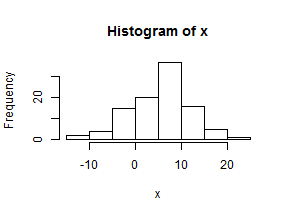

What did we learn last time?
============================

```r
# Draw a 100 points from a random normal of 100 with mean =6, sd =7
x <- rnorm(100, 6, 7)
# view distribution
hist(x)
```

 

```r
# sample 5 without replacement
sample(x, 5)
```

```
## [1]  7.078 13.304  3.044 -0.104 -9.311
```


--- &twocol

Beyond Vectors - Beginning with Data frames
===========================================

A data frame is a very important data type in R. It's pretty much the de facto data structure for most tabular data and what we use for statistics. Data frames can have additional attributes such as rownames() and colnames(). This can be useful for annotating data.

**Useful functions**  

*** left

- 1. head() - see first 5 rows
- 2. tail() - see last 5 rows
- 3. dim() - see dimensions

*** right

- 4. nrow() - number of rows
- 5. ncol() - number of columns
- 6. str() - structure of the object

