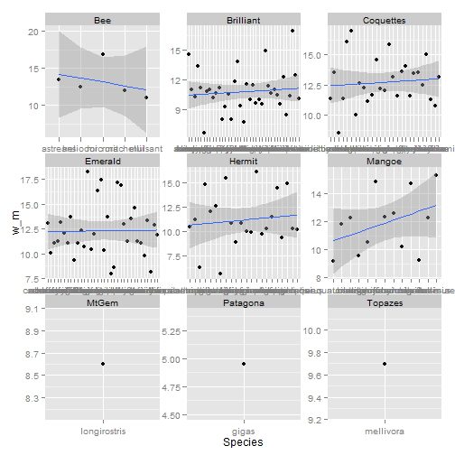

10min Group Assignment - Answers
=================
Choose one of the following challenges.

1. Create a paneled ggplot figure using facet_wrap() that shows the allometric relationship between mass and wingchord for each clade. Add a **linear** smoothing line following the instructions in stat_smooth()


```r
traits <- read.csv("C:/Users/Ben/Desktop/Traits.csv")
require(ggplot2)
```

```
## Loading required package: ggplot2
```

```r
# Create new column for the w/m ratio
traits$w_m <- traits$WingChord/traits$Mass

ggplot(traits, aes(x = Mass, y = WingChord, col = Clade)) + geom_point() + geom_smooth(method = "lm", 
    aes(group = 1)) + facet_wrap(~Clade)
```

 

```r
ggplot(traits, aes(x = Species, y = w_m)) + geom_point() + geom_smooth(aes(group = 1), 
    method = "lm") + facet_wrap(~Clade, scales = "free")
```

 


2. Does the number of species in a genus relate to the variance in body size?


```r
# Find the number of species in a genus using a cotingency table
sp_g <- data.frame(table(traits$Genus))

# name the columns
colnames(sp_g) <- c("Genus", "N")

for (i in 1:nrow(sp_g)) {
    genus <- sp_g[i, "Genus"]
    # subset the data for that genus
    genus_t <- traits[traits$Genus == genus, ]
    # Get the variance in bill size and place it in an output
    sp_g[i, "Var_bill"] <- var(genus_t$Bill)
}

# plot the result
ggplot(sp_g, aes(x = N, y = Var_bill)) + geom_point() + geom_smooth()
```

```
## geom_smooth: method="auto" and size of largest group is <1000, so using loess. Use 'method = x' to change the smoothing method.
```

```
## Warning: Removed 29 rows containing missing values (stat_smooth).
## Warning: pseudoinverse used at 1.935
## Warning: neighborhood radius 3.065
## Warning: reciprocal condition number  0
## Warning: There are other near singularities as well. 9
## Warning: pseudoinverse used at 1.935
## Warning: neighborhood radius 3.065
## Warning: reciprocal condition number  0
## Warning: There are other near singularities as well. 9
## Warning: Removed 29 rows containing missing values (geom_point).
```

 

```r
ggplot(sp_g, aes(x = N, y = Var_bill)) + geom_point() + geom_smooth(method = "lm") + 
    ylim(0, 12)
```

```
## Warning: Removed 31 rows containing missing values (stat_smooth).
## Warning: Removed 31 rows containing missing values (geom_point).
```

 

