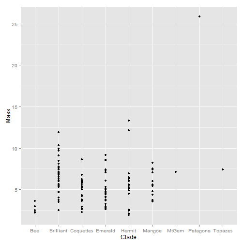
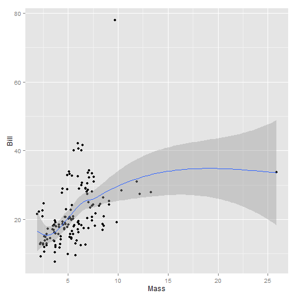

As scientists, our major currency is data. R provides a common ground for data analysis. Using R for data visualization, exploration, and analysis opens up a massive set of tools. You will find that nothing, absolutely nothing, you will do has not been atleast tried before. There are packages covering every imaginable type of ecological, evolutionary, and statiscal approaches. Today we will discuss how to read in data, perform basic functions, and produce figures. 


---

The Data
========

----
Tips for Importing Data
=======================

Data is easiest to read in a .csv format, in excel, save as -> comma seperated csv. 

Avoid Spaces, Special Characters, or hanging lines of data.

---

```r
# Load in the ggplot2 library, which we will use later.
library(ggplot2)
traits <- read.csv("C:/Users/Jorge/Documents/Rcourse/Data/Traits.csv")
head(traits)
```

```
##   X     Clade        Genus         Species                   double
## 1 1 Coquettes    Adelomyia     melanogenys    Adelomyia melanogenys
## 2 2 Brilliant   Aglaeactis     cupripennis   Aglaeactis cupripennis
## 3 3 Coquettes Aglaiocercus       coelestis   Aglaiocercus coelestis
## 4 4 Coquettes Aglaiocercus           kingi       Aglaiocercus kingi
## 5 5   Emerald     Amazilia        amazilia        Amazilia amazilia
## 6 6   Emerald     Amazilia castaneiventris Amazilia castaneiventris
##                        English  Bill  Mass WingChord
## 1         Speckled Hummingbird 15.04 4.245     55.87
## 2              Shining Sunbeam 18.71 8.440     85.62
## 3          Violet-tailed Sylph 16.25 6.070     68.68
## 4            Long-tailed Sylph 15.77 5.530     67.12
## 5         Amazilia Hummingbird 18.54 4.070     53.33
## 6 Chestnut-bellied Hummingbird 18.70 4.750     52.70
```


---
Data Explortation
-------------------

It is critical to consider your data carefully. Are they categorical, are they numeric, how much variance is there? Are they complete?
For categorical data, the best place to start are contingency tables
How many speccies per clades are there?
For continues data, try *range*, *sd* *mean*

```r
table(traits$Clade)
```

```
## 
##       Bee Brilliant Coquettes   Emerald    Hermit    Mangoe     MtGem 
##         5        37        27        34        22        13         1 
##  Patagona   Topazes 
##         1         1
```

```r
mean(traits$Bill)
```

```
## [1] 21.41
```


---
**Try It!**
------------
1. What are the range of body sizes? 
2. Which genus has the most species?
3. Look up the which.max function; read the help screen; which species has the longest bill?
4. Create a two way table of genus and clade, what does this show?


---
ggplot2
-----------------

The ggplot library is the gold-standard for plotting. It allows basic, intuitive, plots that can be endlessly customized. The help screens are full of clear examples, and there is a massive online community to search basic plotting questions. Let's explore our first plot.

---&twocol

***left
    * Allometry of Wing Length and Mass

```r
ggplot(traits, aes(x = WingChord, y = Mass)) + geom_point()
```

 


 ***right
    * Parsed: Create a plot from the data frame traits, with matching the datatype and properties of the column WingChord on the x axis, and Mass on the Y axis. Add points. 

---

For now, we will always be setting global aesthestics inside the *ggplot()* and not the *geom_point()*.


```r
ggplot(traits, aes(x = Clade, y = Mass)) + geom_point()
```

 

```r
# What if we want something besides points
```


---


```r
ggplot(traits, aes(x = Clade, y = Mass)) + geom_boxplot()
```

 


#There are many geom_styles type geom_ and hit tab to see types, and then using ?geom_nameofgeom to see their help screens 
```
Building more complex plots
---------------------------

Continious colors can be added (and edited) to add more information

```r
ggplot(traits, aes(x = Mass, y = WingChord, color = Bill)) + geom_point()
```

 


---

Building more complex plots
---------------------------
Shapes and sizes can be added as well, note how ggplot automatically groups by both variables. In this case we have a bit too many to make it helpful, but it depends on your data.


```r
ggplot(traits, aes(x = Mass, y = WingChord, color = Bill, shape = Clade)) + 
    geom_point()
```

 


ggplot is very smart. Trust it.

---

Shapes and sizes can be added as well, note how ggplot automatically groups by both variables. In this case we have a bit too many to make it helpful, but it depends on your data.


```r
ggplot(traits, aes(x = Bill, y = WingChord, color = Clade, size = Mass)) + geom_point()
```

 


ggplot is very smart. Trust it.
---

**Try it!**
------------

1. Plot Bill as a function of Wingchord, save it as object p
2. Plot Bill against clade membership, which clade has the lowest median bill size?
3. Look up geom_histogram, what does it go? made a histogram of Bill sizes.
4. Color your histogram by clade membership, which clade does the outlier belong to?

---

Adding multiple geometries to a plot
------------------------------------

Often we want to express more information than a single geometric object, ggplot allows us immense flexiblity by allowing us to build on our initial plot


```r
p <- ggplot(traits, aes(x = Mass, y = Bill)) + geom_point() + geom_smooth()
p
```

 


---
Practice plotting
====================
To show some more features, let's make a bit smaller dataset

#Given a bit smaller dataset, we can explore more options, add both color and shape, drawing on what we've done already, how would we subset our data to just get the coquettes clades?

Add image of a coquette here.
---

```r
coq <- droplevels(traits[traits$Clade == "Coquettes", ])
```


---
Text can be added, and manipulated directly
============================================


```r
ggplot(coq, aes(x = Bill, y = WingChord, size = Mass, label = Genus)) + geom_point() + 
    geom_text(size = 3)
```

 


---


```r
ggplot(coq, aes(x = Species, y = WingChord, col = Bill, size = Mass)) + geom_point() + 
    facet_grid(~Genus, scales = "free") + theme_bw() + theme(axis.text.x = element_text(angle = -90)) + 
    scale_color_continuous(low = "blue", high = "red") + ylab("Wing Length")
```

 


---
10min Group Assignment
=================

Come up with a simple question and represent it graphically

---
Exporting Dataframes
=======

If we want to export the data that we created, we can save it to file as a csv


```r
write.csv(coq, "Coquettes.csv")
```


