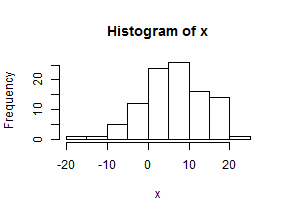

What did we learn last time?
============================

```r
# Draw a 100 points from a random normal of 100 with mean =6, sd =7
x <- rnorm(100, 6, 7)
# view distribution
hist(x)
```

 

```r
# sample 5 without replacement
sample(x, 5)
```

```
## [1] 12.4406 12.1714  0.2689  0.7226 -4.5384
```


--- &twocol

Beyond Vectors - Beginning with Data frames
===========================================

A data frame is a very important data type in R. It's pretty much the de facto data structure for most tabular data and what we use for statistics. Data frames can have additional attributes such as rownames() and colnames(). This can be useful for annotating data.

**Useful functions**  

*** left

- 1. head() - see first 5 rows
- 2. tail() - see last 5 rows
- 3. dim() - see dimensions

*** right

- 4. nrow() - number of rows
- 5. ncol() - number of columns
- 6. str() - structure of the object

---
Data frames are usually read in from file, but R comes with many practice datasets. We will use the iris dataset, famously used by Fisher in 1936 (http://en.wikipedia.org/wiki/Iris_flower_data_set)

**head(iris)**

<!-- html table generated in R 3.0.1 by xtable 1.7-1 package -->
<!-- Thu Dec 12 15:44:32 2013 -->
<TABLE border=1>
<TR> <TH>  </TH> <TH> Sepal.Length </TH> <TH> Sepal.Width </TH> <TH> Petal.Length </TH> <TH> Petal.Width </TH> <TH> Species </TH>  </TR>
  <TR> <TD align="right"> 1 </TD> <TD align="right"> 5.10 </TD> <TD align="right"> 3.50 </TD> <TD align="right"> 1.40 </TD> <TD align="right"> 0.20 </TD> <TD> setosa </TD> </TR>
  <TR> <TD align="right"> 2 </TD> <TD align="right"> 4.90 </TD> <TD align="right"> 3.00 </TD> <TD align="right"> 1.40 </TD> <TD align="right"> 0.20 </TD> <TD> setosa </TD> </TR>
  <TR> <TD align="right"> 3 </TD> <TD align="right"> 4.70 </TD> <TD align="right"> 3.20 </TD> <TD align="right"> 1.30 </TD> <TD align="right"> 0.20 </TD> <TD> setosa </TD> </TR>
  <TR> <TD align="right"> 4 </TD> <TD align="right"> 4.60 </TD> <TD align="right"> 3.10 </TD> <TD align="right"> 1.50 </TD> <TD align="right"> 0.20 </TD> <TD> setosa </TD> </TR>
  <TR> <TD align="right"> 5 </TD> <TD align="right"> 5.00 </TD> <TD align="right"> 3.60 </TD> <TD align="right"> 1.40 </TD> <TD align="right"> 0.20 </TD> <TD> setosa </TD> </TR>
  <TR> <TD align="right"> 6 </TD> <TD align="right"> 5.40 </TD> <TD align="right"> 3.90 </TD> <TD align="right"> 1.70 </TD> <TD align="right"> 0.40 </TD> <TD> setosa </TD> </TR>
   </TABLE>


---
**Try It!**
------------
1. View the dataset using head and tail
2. How many rows does the data have?
3. How many columns? What are the column names?
4. Using the str function, how many species are in the data?

---
Dataframe Syntax and subsetting
-------------------------------
R has many powerful subset operators and mastering them will allow you to easily perform complex operation on any kind of dataset. Allows you to manipulate data very succinctly.

While not technically accurate, dataframes are akin to a series of vectors combined into a tabular structure. Dataframes have a particular syntax, which is an extension of vector syntax. First let's use the $ sign to call a column

---

```r
head(iris)
```

  Sepal.Length Sepal.Width Petal.Length Petal.Width Species
1          5.1         3.5          1.4         0.2  setosa
2          4.9         3.0          1.4         0.2  setosa
3          4.7         3.2          1.3         0.2  setosa
4          4.6         3.1          1.5         0.2  setosa
5          5.0         3.6          1.4         0.2  setosa
6          5.4         3.9          1.7         0.4  setosa


